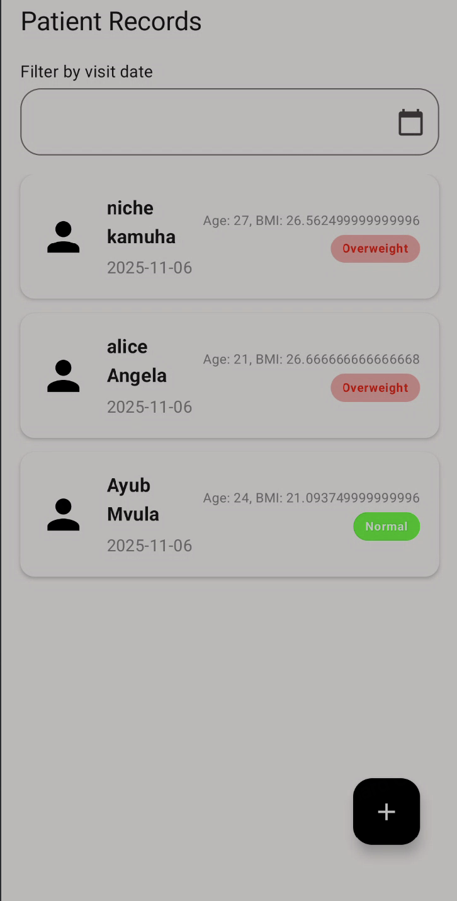
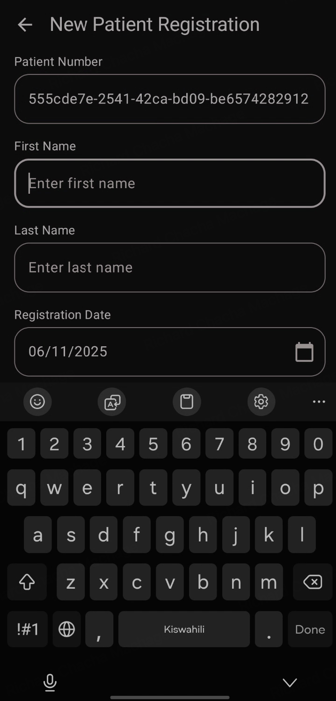
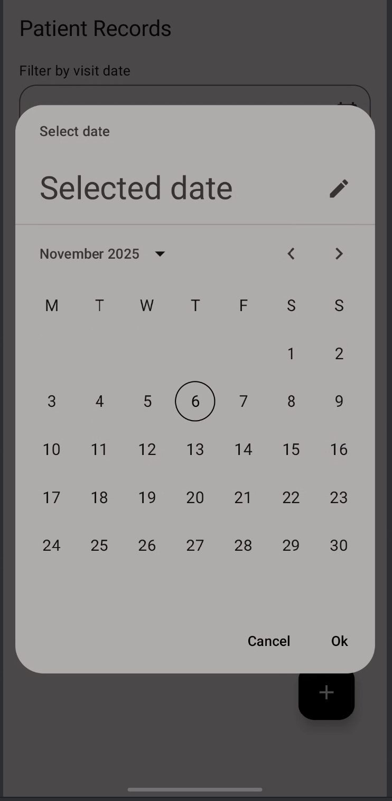

# Patient Management Android App

## Features

* **User Authentication:** Secure Sign-up and Login screens to protect patient data.
* **Patient Registration:** An intuitive form to register new patients, capturing essential details like name, date of birth, and gender.
* **Patient Dashboard:** A comprehensive list of all patients, filterable by visit date. Each item displays key information at a glance, including name, age, last BMI, and BMI status (e.g., Normal, Overweight).
* **Vitals Recording:** A dedicated screen to enter patient vitals (height and weight), with automatic BMI calculation.
* **Dynamic Assessments:** After saving vitals, the app intelligently navigates to the correct assessment form:
    * **General Assessment:** For patients with a normal BMI.
    * **Overweight Assessment:** For patients with a high BMI.
* **Offline-First Architecture:** New patient data, vitals, and assessments are saved to a local Room database first, ensuring the app works without an internet connection.
## Tech Stack & Architecture

This project demonstrates a modern Android architecture using a collection of libraries that would ease transition to KMP.

* **Core Language:** **Kotlin**
* **User Interface:** **Jetpack Compose** for building the entire UI declaratively.
* **Architecture:** **MVVM (Model-View-ViewModel)**. Each screen (or feature) has its own ViewModel that provides state to the UI and handles business logic.
* **Asynchronous:** **Kotlin Coroutines** and **Flow** are used extensively for managing background tasks, API calls, and database operations.
* **Dependency Injection:** **Koin** is used to manage and inject dependencies (like Repositories, ViewModels, and data sources) throughout the app.
* **Navigation:** **Jetpack Navigation for Compose** handles all screen transitions and argument passing.
* **Networking:** **Ktor Client** is used for making type-safe HTTP requests to the remote API.
* **Local Storage (Database):** **Room** provides a local SQLite database for caching patient data, vitals, and assessments.
* **Local Storage (Preferences):** **SharedPreferences** is used to persist the user's authentication token.
* **Logging:** **Timber** for robust and manageable logging.

## Project Structure

The project is organized into feature-based packages (`auth`, `patients`, `registration`, `vitals`, `assessment`) with a central `core` package for shared components.

* `/app/src/main/java/dev/forsythe/patientmanagement/`
    * **`app`**: Contains the main `Application` class (`PmApplication`) for Koin and Timber setup.
    * **`core`**: Shared modules used across the application.
        * **`data`**: Contains the `PatientRepository`, `KtorClient`, `Room` database setup, and `SharedPreferences`.
        * **`di`**: Koin modules (`DataModule`, `ViewModelModule`).
        * **`model`**: App-wide data models like `BmiStatus` and `Gender`.
        * **`ui`**: Shared Jetpack Compose components (`FormTextField`, `PrimaryButton`, `EmptyState`, etc.), `Navigation` graph, and `Theme`.
    * **`feature`**: Contains individual feature packages, each with its own UI (Screen) and ViewModel.
        * **`auth`**: `LoginScreen` and `SignUpScreen`.
        * **`patients`**: `PatientListingScreen` and `PatientListItem`.
        * **`registration`**: `PatientRegistrationScreen`.
        * **`vitals`**: `PatientVitalsScreen`.
        * **`assessment`**: `AssessmentScreen`.

## How to Build

1.  Clone the repository.
2.  Open the project in Android Studio.
3.  The project uses Gradle and should sync automatically.
4.  Run the `app` configuration on an Android emulator or physical device (API 26+).

## Screenshots

